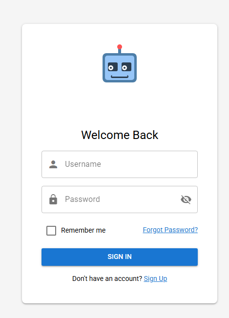

# 🤖 Interactive Robot Login

An engaging Vue/Quasar login component featuring an interactive robot character that responds to user input in real-time. Similar to [TunnelBear's](https://www.tunnelbear.com/account/login) animated bear, this robot follows along as users type their username and covers its eyes when entering passwords.



[Live Demo](https://your-demo-url.com)

## ✨ Features

- **Interactive Robot Character**:

  - Eyes follow text input from left to right as you type your username.
  - Eyes follow a natural curved path for more lifelike movement.
  - Robot covers its eyes when you're typing a password.
  - Robot peeks when you toggle password visibility.
  - Smooth, playful animations for all state transitions.

- **User-Friendly Authentication Form**:
  - Clean, modern Quasar Framework UI components.
  - Username and password fields with appropriate validation.
  - Show/hide password toggle.
  - "Remember me" option.
  - Forgot password link.
  - Sign-up link for new users.

## 🛠️ Technologies Used

- [Vue.js 3](https://vuejs.org/) with Composition API.
- [Quasar Framework](https://quasar.dev/) for UI components.
- SVG for the interactive robot character.
- CSS animations and transitions.

## 🚀 Installation

### Prerequisites

- Node.js (v14+).
- npm or yarn.

### Setup

1. Clone this repository:

   ```bash
   git clone https://github.com/austin-jones-02/Interactive-Vue-Sign-In-Page.git
   cd interactive-robot-login
   ```

2. Install dependencies:

   ```bash
   npm install
   # or with yarn
   yarn install
   ```

3. Start the development server:

   ```bash
   npm run dev
   # or with yarn
   yarn dev
   ```

4. Open your browser and navigate to `http://localhost:9000` (or the port shown in your terminal).

## 🔍 How It Works

### Eye Movement System

The robot's eyes follow your typing using dynamic SVG positioning:

```javascript
// Calculate the normalized position (0-1) based on text length
const position = Math.min(textLength / maxLength, 1)

// Create horizontal movement
const eyeOffset = position * eyeMovementRange.value

// Create a curved path using sine function
const verticalOffset = position > 0 ? 2 * Math.sin(position * Math.PI) : 0

// Update SVG positions
leftEyeX.value = baseLeftEyeX.value + eyeOffset
eyeY.value = baseEyeY.value + verticalOffset
```

### Eye Cover Animations

The eye covering/revealing animations use CSS keyframes with built-in delays:

```css
/* Animation for covering eyes */
@keyframes cover-eyes {
  0% {
    transform: scaleY(0);
    opacity: 0;
  }
  10% {
    transform: scaleY(0.1);
    opacity: 0.3;
  }
  100% {
    transform: scaleY(1);
    opacity: 1;
  }
}
```

## 🎨 Customization

### Changing Colors

You can easily customize the robot's appearance by modifying the SVG fill attributes:

```html
<!-- Robot Head -->
<rect x="25" y="20" width="70" height="60" rx="8" fill="#4D7EA8" />
<!-- Change this color -->
<rect x="30" y="25" width="60" height="50" rx="5" fill="#96C5F7" />
<!-- Change this color -->
```

### Adjusting Eye Movement

Modify the eye movement range and curve:

```javascript
// For more/less horizontal movement
const eyeMovementRange = ref(8) // Increase or decrease

// For more/less curve
const verticalOffset = position > 0 ? 4 * Math.sin(position * Math.PI) : 0 // Change multiplier
```

## 📄 License

This project is licensed under the MIT License.

## 🙏 Acknowledgments

- Inspired by TunnelBear's interactive login feature.
- Built with [Quasar Framework](https://quasar.dev/).
- SVG animations adapted from various open-source examples.

---

Made with ❤️ by [Austin Jones](https://github.com/austin-jones-02)
